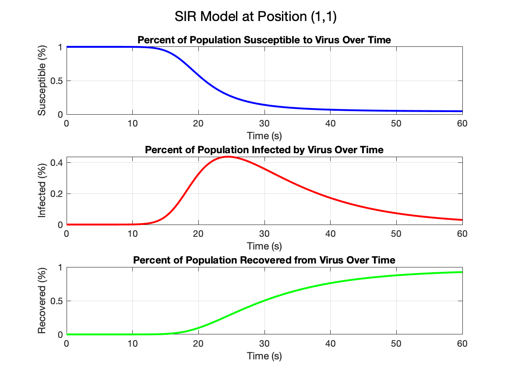
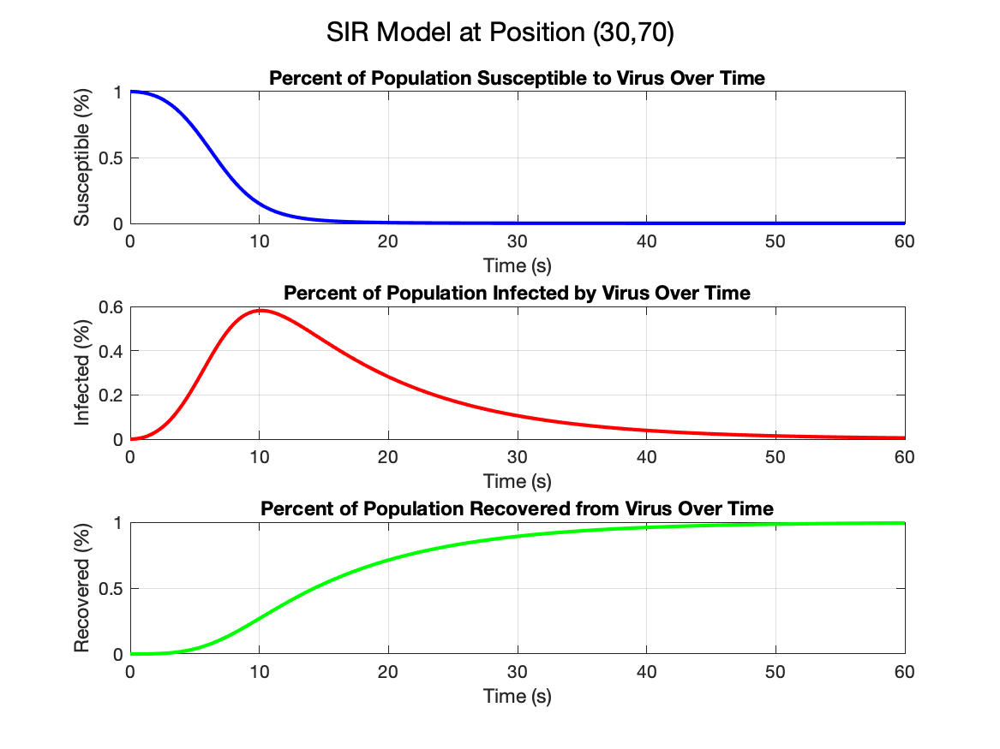
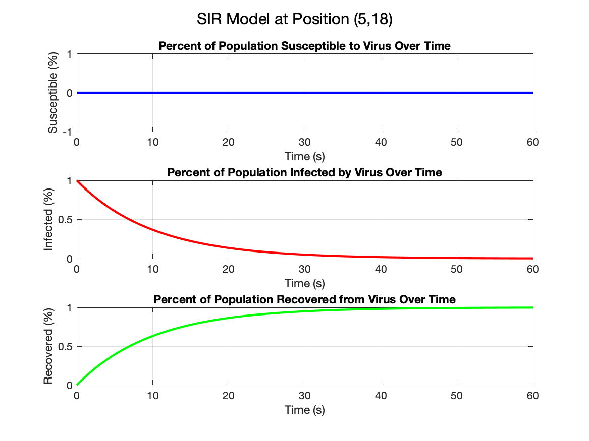

# COVID Spread Modeling

I built this model using MATLAB to simulate the spread of COVID using a susceptible, infected, and recovered model. It creates a visual animation as well as graphs showing the susceptible, infected, and recovered populations.

### Animation

  
In this animation blue represents the susceptible population, red represents the infected population, and green represents the recovered population. At the start there are a few areas with infected populations (red dots) randomly scattered about, then the infection spreads to the nearby susceptible populations until everyone has had the virus, and over time the populations recover from the virus until everyone is recovered (entire screen is green). Each pixel is colored using an RGB color model, with the amount of blue in the pixel corresponding to the percent of the population in that area that are susceptible, the amount of red corresponding to the percentage that are infected, and the amount of green corresponding to the percentage that are recovered. 

### Graphs

  
  
  

These graphs show the percentage of the population at a specific location in the animation that fall into each of the susceptible, infected, and recovered categories over time.
